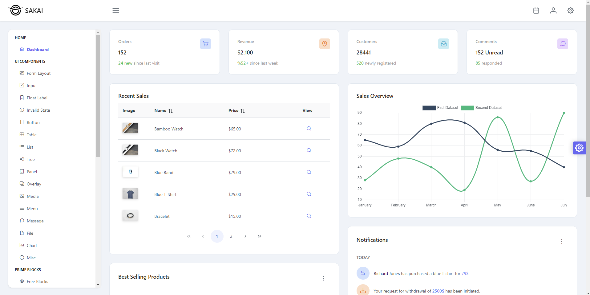

<p align="center"><a href="https://laravel.com" target="_blank"></a></p>

<p align="center">
<a href="https://github.com/laravel/framework/actions"></a>
<a href="https://packagist.org/packages/laravel/framework"></a>
<a href="https://packagist.org/packages/laravel/framework"></a>
<a href="https://packagist.org/packages/laravel/framework"></a>
</p>

This template should help get you started developing with Vue 3 in Laravel and Vite.

## Customize configuration

See [Vite Configuration Reference](https://vitejs.dev/config/).
 [Sakai Vue](https://github.com/primefaces/sakai-vue).


## Frontend Setup

```sh
npm install
```

### Compile and Hot-Reload for Development

```sh
npm run dev
```

### Compile and Minify for Production

```sh
npm run build
```

## Laravel Setup

```sh
composer install
```

### Laravel Run Server

```sh
php artisan serve
```
